# fetchReceipt

Flask web service to generate ID fo valid receipt and calculate the reward points for the receipts based on business logic.

## Test cases can be found on https://github.com/fetch-rewards/receipt-processor-challenge page's readme..

## Table of Contents

- [Installation](#installation)
- [Testing](#testing)

## Installation

###Installation method 1: Docker install
If you would like to run the code directly using docker you can follow the below steps.

1. Clone the repo
```bash
git clone https://github.com/sujayk96/fetchReceipt.git
```
2. Build the docker image
```bash
docker build -t <my-image> .
```
use any name for the image
3. Run the docker container
```bash
docker run -p 4000:8000 <my-image>
```
4. Access the API
You can typically access it through a web browser by navigating to http://localhost:4000, where 4000 is the host port mapped in the docker run command.

5. Check out the APIs <br>


### Installation method 2: Plain install
If you would like to run the code with out docker.
### Make sure you have python 3.11
0. Install python 3.11 from python's website.

1. Clone the repo
```bash
git clone https://github.com/sujayk96/fetchReceipt.git
```

2. Install pipenv if you don't have it installed
```bash
pip install pipenv
```

3. Create virtual env
```bash
pipenv shell
```

4. Install dependancies
```bash
pipenv install
```

4.1 Make sure the python version is 3.11 in Pipfile.

5. Run Flask application
```bash
python run.py
```

6. Checkout the APIs.

Path1: Path: /receipts/process <br>
Method: POST <br>
Payload: Receipt JSON <br>
Response: JSON containing an id for the receipt.<br><br>
Path2: /receipts/{id}/points<br>
Method: GET<br>
Response: A JSON object containing the number of points awarded.<br>

## Testing
1. Running given example 1
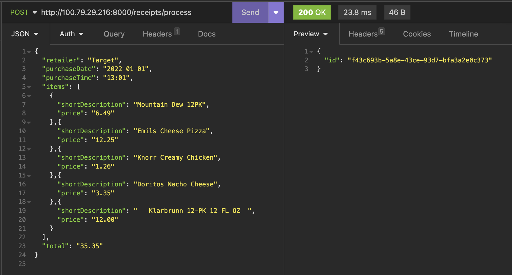
ID generated. Status code: 200

2. Running given exapmle 2
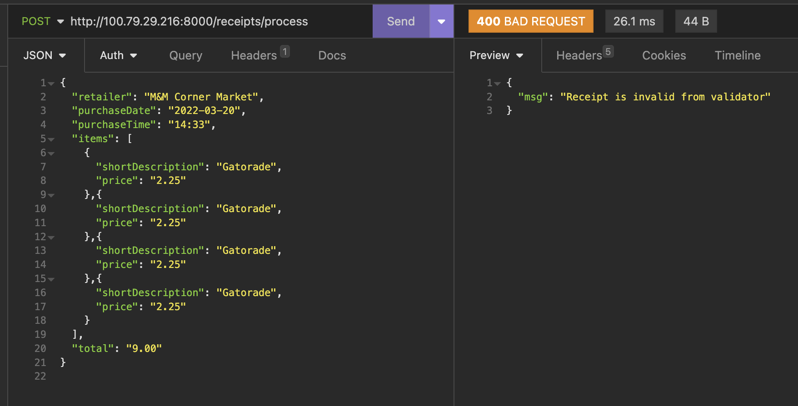
Test Failed. Status Code: 400
### Reason: Retailer name has white spaces. The api.yml provided contains schema which doesnot allow white spaces in Reatiler Name.

3. Running given example 3
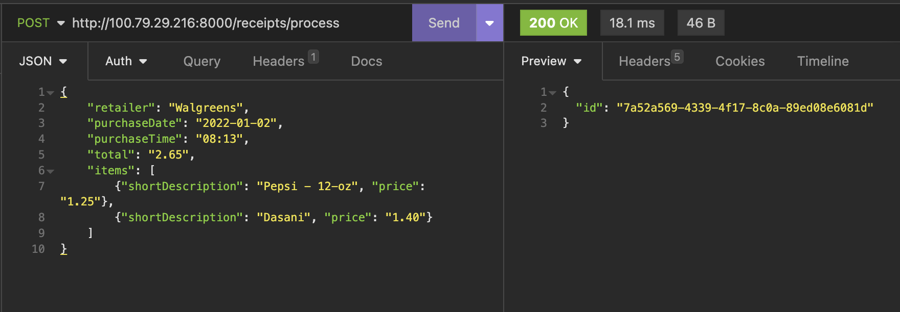
ID generated. Status code: 200

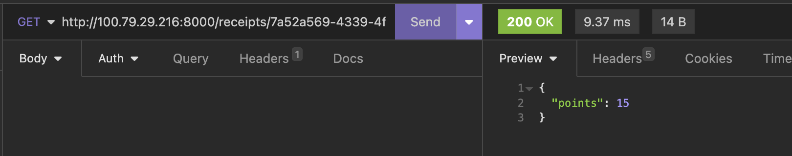

4. Running given exaple 4
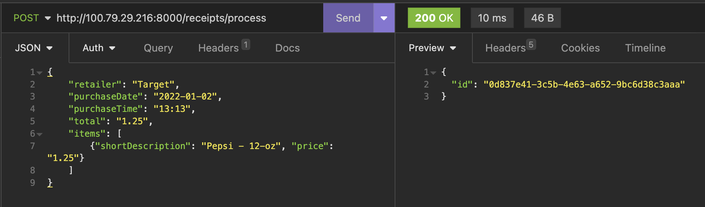
ID generated. Status code: 200

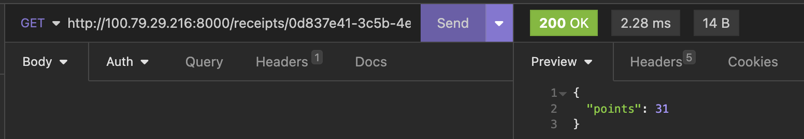

### Testing Boundary cases
5. RetailerName regex check
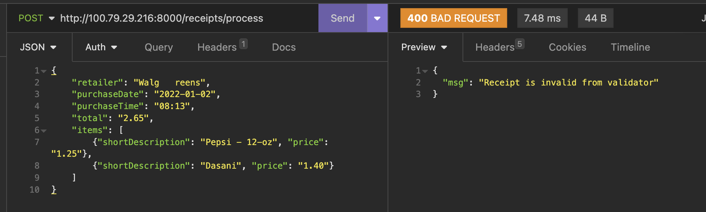

6. Invalid Date
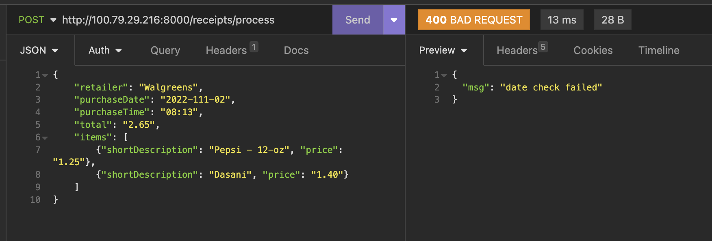

7. Invalid Time regex
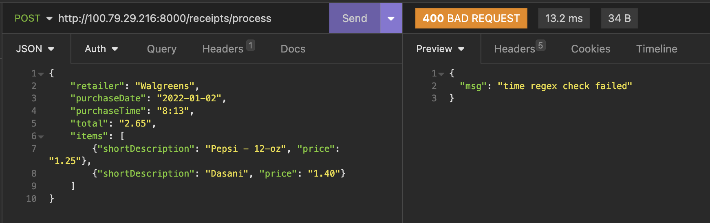

8. Sum of prices equals to total
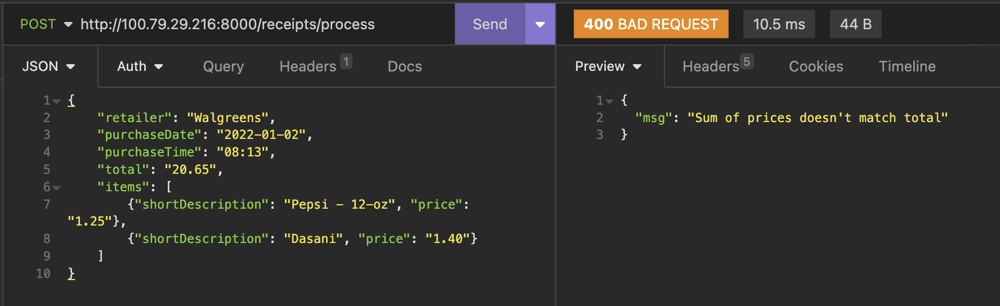

9. Min one item condition
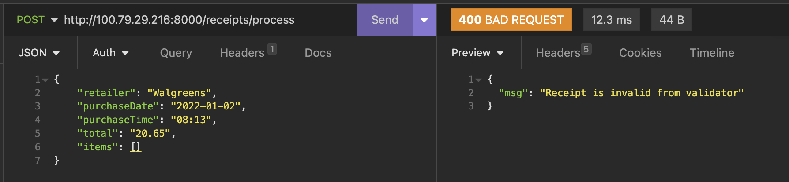

10. Schema Validation
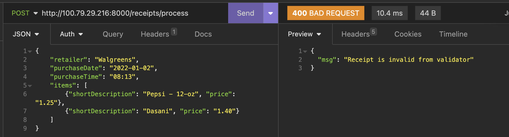
